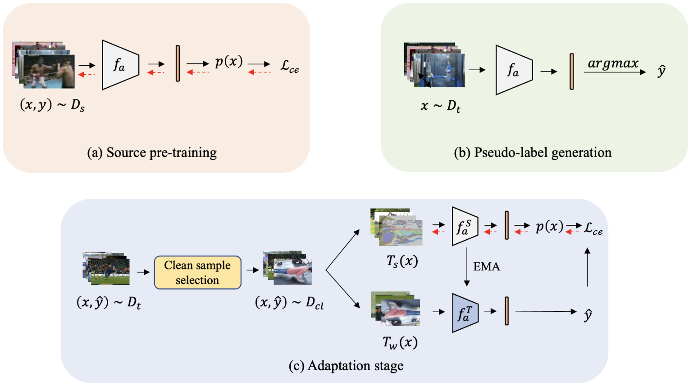

# CleanAdapt

> [Overcoming Label Noise for Source-free Unsupervised Video Domain Adaptation](https://arxiv.org/abs/2311.18572)

> This is the reproduced code repository for "Overcoming Label Noise for Source-free Unsupervised Video Domain Adaptation", ICVGIP'22.


## Introduction

<!-- [ALGORITHM] -->

<a href="https://github.com/avijit9/CleanAdapt">Official Repo</a>

## Abstract

<!-- [ABSTRACT] -->

Despite the progress seen in classification methods,
current approaches for handling videos with distribution shifts
in source and target domains remain source-dependent as they
require access to the source data during the adaptation stage. In
this paper, we present a self-training based source-free video domain adaptation approach to address this challenge by bridging
the gap between the source and the target domains. We use the
source pre-trained model to generate pseudo-labels for the target
domain samples, which are inevitably noisy. Thus, we treat the
problem of source-free video domain adaptation as learning from
noisy labels and argue that the samples with correct pseudo-labels
can help us in adaptation. To this end, we leverage the crossentropy loss as an indicator of the correctness of the pseudo-labels
and use the resulting small-loss samples from the target domain
for fine-tuning the model. We further enhance the adaptation
performance by implementing a teacher-student framework, in
which the teacher, which is updated gradually, produces reliable
pseudo-labels. Meanwhile, the student undergoes fine-tuning on
the target domain videos using these generated pseudo-labels
to improve its performance. Extensive experimental evaluations
show that our methods, termed as CleanAdapt, CleanAdapt +
TS, achieve state-of-the-art results, outperforming the existing
approaches on various open datasets.

Official source code is publicly available at: [this http URL](https://avijit9.github.io/CleanAdapt/).


<!-- [IMAGE] -->

<div align=center>

</div>


## Installation
Clone this repository
```
git clone https://github.com/sayandebroy-csmi/cleanadapt.git

cd cleanadapt
```


Setup Environment
```
conda create -n "cadapt" python=3.8

conda activate cadapt
```

Install Pytorch on GPU Platform
```
pip install torch==2.0.1 torchvision==0.15.2 --index-url https://download.pytorch.org/whl/cu118
```

Install other dependencies
```
pip install pytorchvideo

pip install opencv-python

pip install scikit-image
```


## Dataset folder Structure
```
data
├── flow
├── rgb
|   ├── ucf101
|   |   ├──  v_YoYo_g25_c05
|   |   ├──  ...
|   ├── hmdb51

```

### Download i3d pretrained weight: [(link)](https://drive.google.com/file/d/1zp9kKj9WrYO5WZGXpVob1hWcaaYvFKd7/view?usp=drive_link) and store it in the pretrained_weights directory.


## Training:

### UCF -> UCF
```
python train.py --dataset_name ucf101 --batch_size 48


python validate.py --dataset ucf101 --pseudo_label False
```

To generate pseudo labels of UCF
```
python validate.py --dataset ucf101 --pseudo_label True
```


### HMDB -> HMDB
```
python train.py --dataset_name hmdb51 --batch_size 48


python validate.py --dataset hmdb51 --pseudo_label False
```

To generate pseudo labels HMDB
```
python validate.py --dataset hmdb51 --pseudo_label True
```

## Adaptation

During HMDB -> UCF
```
python adaptation.py --dataset_name ucf101 --batch_size 48
```


During UCF -> HMDB
```
python adaptation.py --dataset_name hmdb51 --batch_size 48
```

## Acknowledgements

This work would not have been possible without the invaluable support and guidance of [Avijit Dasgupta](https://avijit9.github.io/), [Dr. Shankar gangisetty](https://sites.google.com/site/shankarsetty/home), Seshadri Mazumder
, and [Prof. C. V. Jawahar](https://faculty.iiit.ac.in/~jawahar/). Their contributions and assistance were helpful in reproducing the results of the paper "Overcoming Label Noise for Source-free Unsupervised Video Domain Adaptation." Thank you for your help and encouragement throughout this project.


## Citation
If you find this helpful, please consider citing:
```bibtex
@inproceedings{dasgupta2024source,
  title={Source-free Video Domain Adaptation by Learning from Noisy Labels},
  author={Dasgupta, Avijit and Jawahar, CV and Alahari, Karteek},
  booktitle={Arxiv},
  year={2024}
}

@inproceedings{dasgupta2022overcoming,
  title={Overcoming Label Noise for Source-free Unsupervised Video Domain Adaptation},
  author={Dasgupta, Avijit and Jawahar, CV and Alahari, Karteek},
  booktitle={ICVGIP},
  year={2022}
}

```